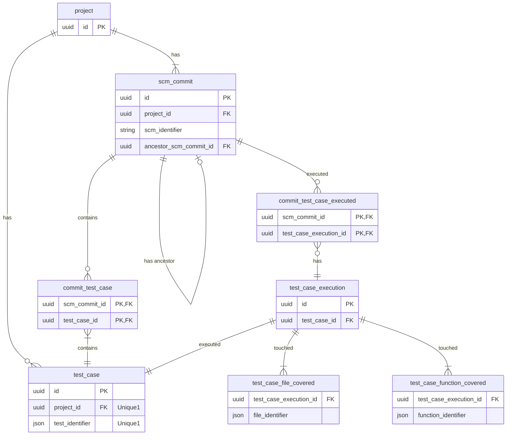
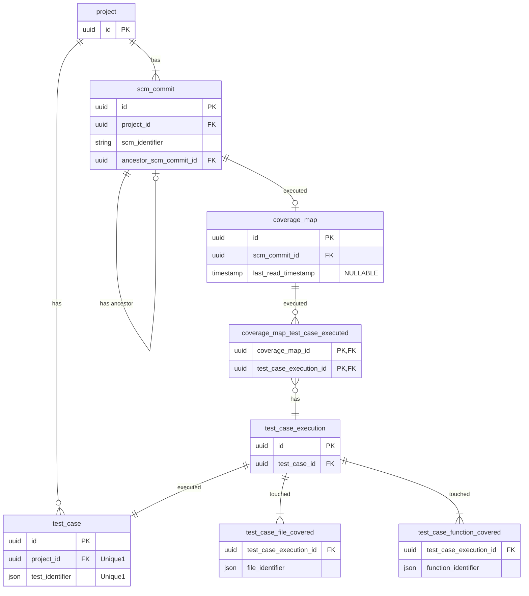

# Normalized Data

```mermaid
erDiagram
    project only one -- one or more scm_commit : has
    project only one -- zero or more test_case : has

    scm_commit only one -- zero or more commit_test_case_executed : executed
    scm_commit only one -- zero or more commit_test_case : contains

    scm_commit only one -- zero or one scm_commit : "has ancestor"

    commit_test_case one or more -- only one test_case : contains

    commit_test_case_executed zero or more -- only one test_case_execution : has

    test_case_execution only one -- only one test_case : executed
    test_case_execution only one -- one or more test_case_file_covered : touched
    test_case_execution only one -- one or more test_case_function_covered : touched

    project {
        uuid id PK
    }
    scm_commit {
        uuid id PK
        uuid project_id FK
        string scm_identifier
        uuid ancestor_scm_commit_id FK
    }
    commit_test_case {
        uuid scm_commit_id PK,FK
        uuid test_case_id PK,FK
    }
    commit_test_case_executed {
        uuid scm_commit_id PK,FK
        uuid test_case_execution_id PK,FK
    }
    test_case {
        uuid id PK
        uuid project_id FK "Unique1"
        json test_identifier "Unique1"
    }
    test_case_execution {
        uuid id PK
        uuid test_case_id FK
    }
    test_case_file_covered {
        uuid test_case_execution_id FK
        json file_identifier
    }
    test_case_function_covered {
        uuid test_case_execution_id FK
        json function_identifier
    }
```

# Denormalized Data

```mermaid
erDiagram
    project only one -- one or more scm_commit : has
    project only one -- zero or more test_case : has

    scm_commit only one -- zero or one coverage_map : executed

    scm_commit only one -- zero or one scm_commit : "has ancestor"

    coverage_map only one -- zero or more coverage_map_test_case_executed : executed
    coverage_map_test_case_executed zero or more -- only one test_case_execution : has

    test_case_execution only one -- only one test_case : executed
    test_case_execution only one -- one or more test_case_file_covered : touched
    test_case_execution only one -- one or more test_case_function_covered : touched

    project {
        uuid id PK
    }
    scm_commit {
        uuid id PK
        uuid project_id FK
        string scm_identifier
        uuid ancestor_scm_commit_id FK
    }
    test_case {
        uuid id PK
        uuid project_id FK "Unique1"
        json test_identifier "Unique1"
    }
    test_case_execution {
        uuid id PK
        uuid test_case_id FK
    }
    test_case_file_covered {
        uuid test_case_execution_id FK
        json file_identifier
    }
    test_case_function_covered {
        uuid test_case_execution_id FK
        json function_identifier
    }
    coverage_map {
        uuid id PK
        uuid scm_commit_id FK
        timestamp last_read_timestamp "NULLABLE"
    }
    coverage_map_test_case_executed {
        uuid coverage_map_id PK,FK
        uuid test_case_execution_id PK,FK
    }

```

