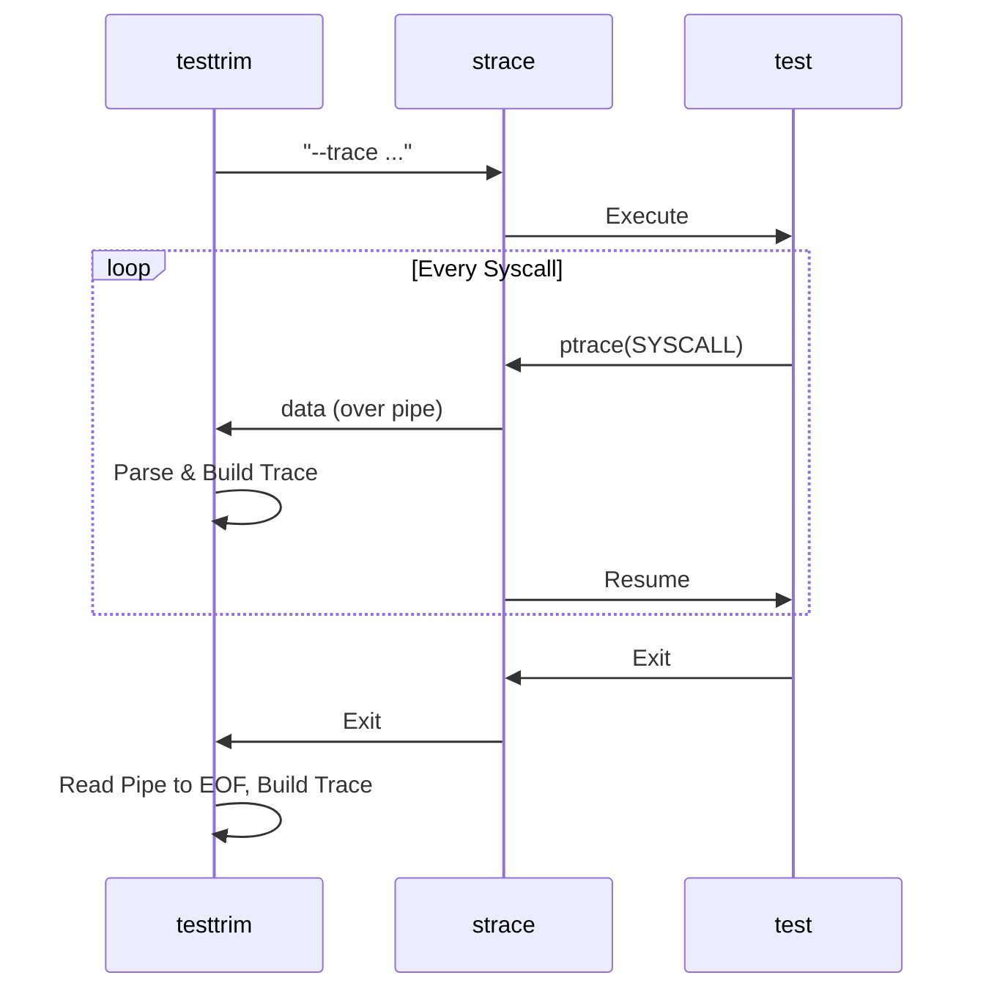
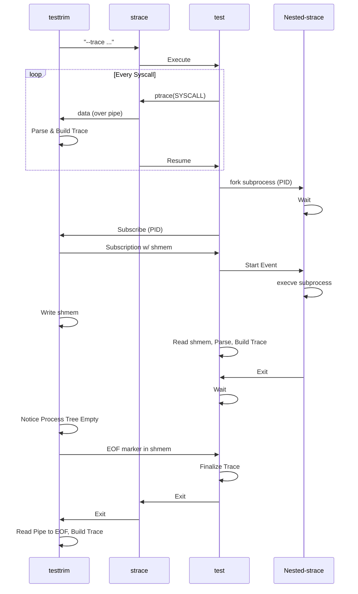

<!--
SPDX-FileCopyrightText: 2024 Mathieu Fenniak <mathieu@fenniak.net>

SPDX-License-Identifier: GPL-3.0-or-later
-->

# strace syscall tracing

In the "straight-forward" approach where testtrim is executing a test under strace:

However, when testtrim runs it's own tests, it can't run a nested strace under strace.  We work around that by having the child process (test) coordinate with the parent process (testtrim) to receive syscall data:

